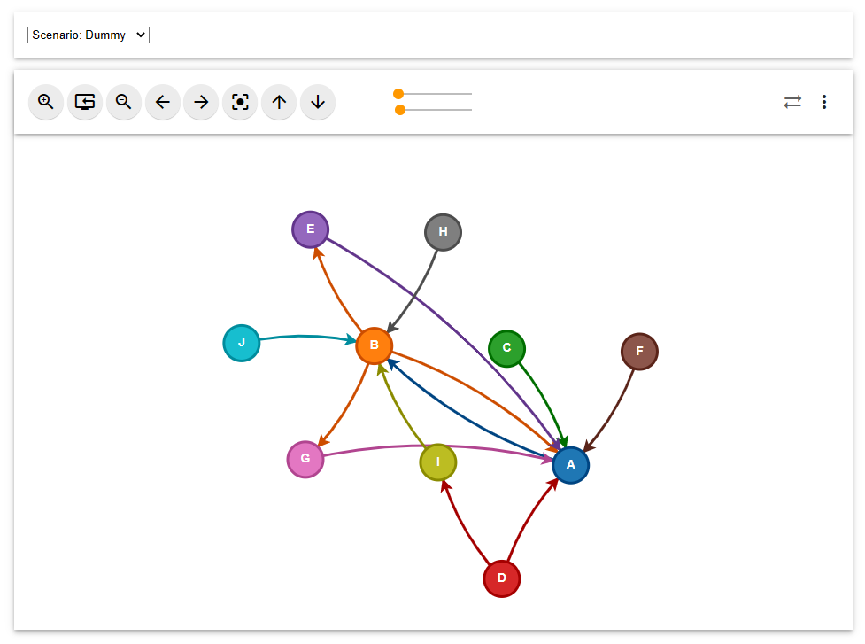
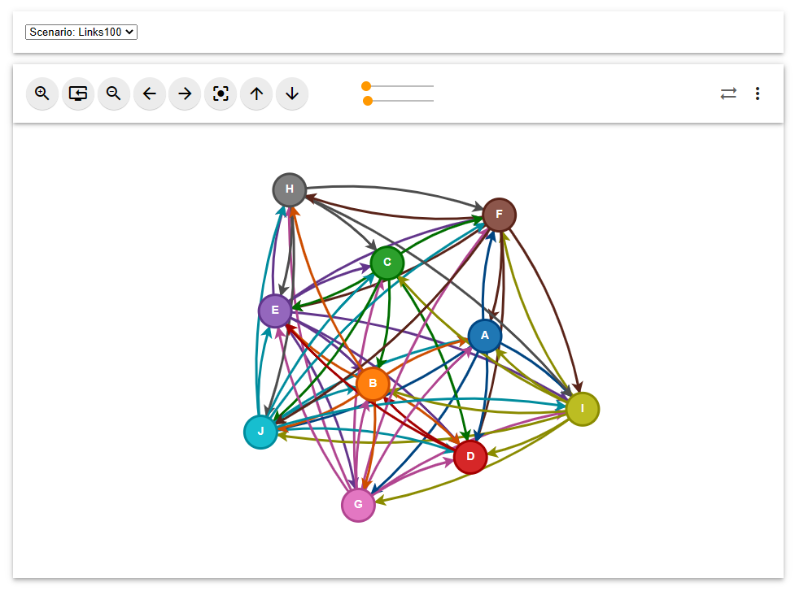
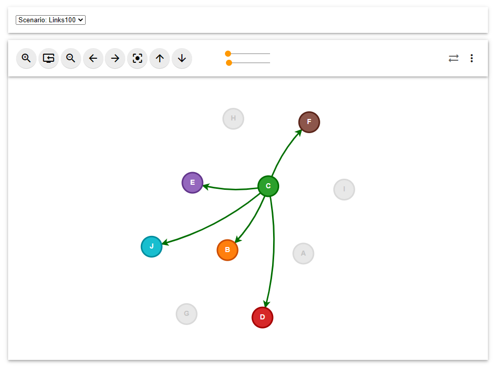
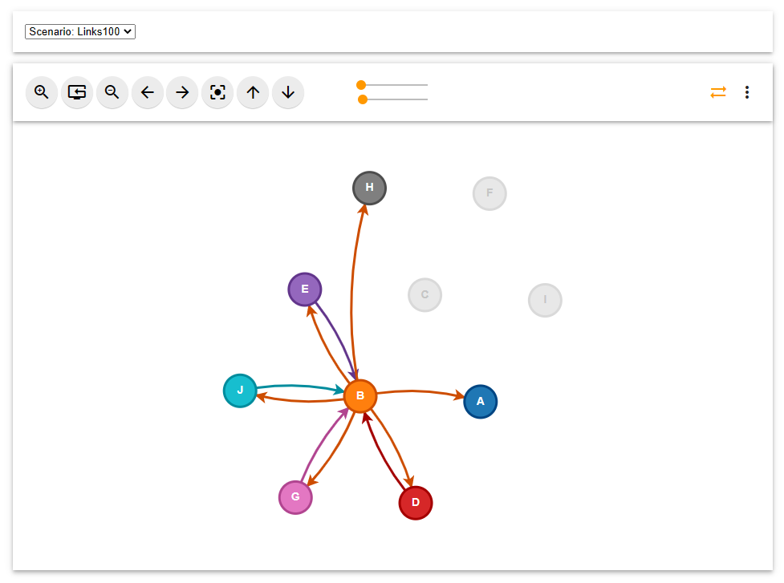

# aTLAS Graph Visualizer
Graph visualization using D3.js

Reference Project: https://vsr.informatik.tu-chemnitz.de/projects/2020/atlas/

## Features
- Zoom (In, Out, Reset)
- Pan (Left, Right, Up, Down, Reset)
- Control Node distances
- Control Link width
- Localization on hover (Unidirectional and Bidirectional)

## Run
Simply open the `graph.html` with any browser. Use the combobox to switch between scenarios.

## Sample Visualizations
### Dummy Scenario

### Scenario with 10 Agents and 100 Links

On hover displays only trusted agents

On hover with `bidirectional switch` enabled (top-right corner) displays trusted agents and the agents who trusts the hovered agent
